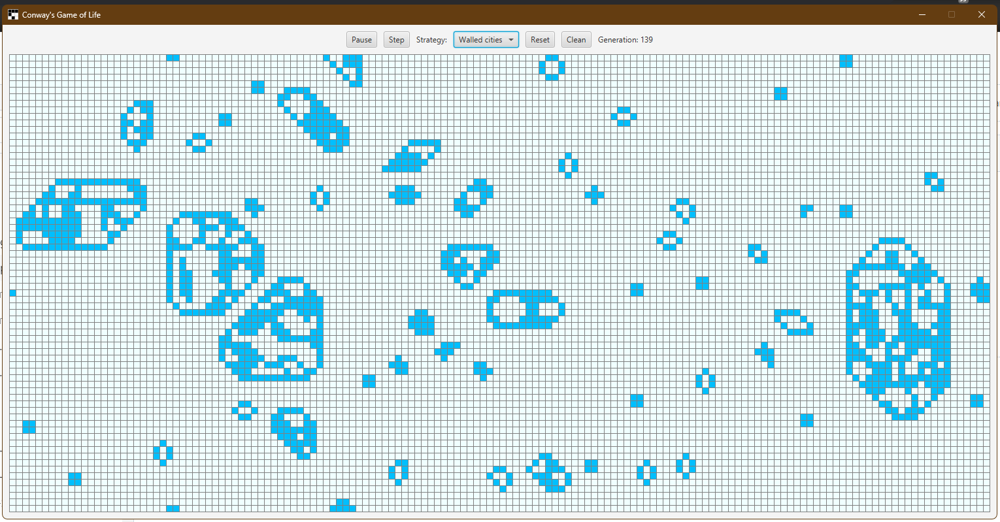

# Game of Life

Java implementation of Conway's Game of Life with UI in JavaFX.

The "game" is a cellular automaton devised by the British mathematician John Horton Conway in 1970, its evolution is determined by its initial state, requiring no further input. One interacts with the Game of Life by creating an initial configuration and observing how it evolves, or, for advanced "players", by creating patterns with particular properties.

The universe of the Game of Life is an infinite two-dimensional orthogonal grid of square cells, each of which is in one of two possible states, alive or dead. Every cell interacts with its eight neighbours, which are the cells that are horizontally, vertically, or diagonally adjacent. At each step in time, the following transitions occur:

1.Any live cell with fewer than two live neighbours dies, as if caused by under-population.

2.Any live cell with two or three live neighbours lives on to the next generation.

3.Any live cell with more than three live neighbours dies, as if by over-population.

4.Any dead cell with exactly three live neighbours becomes a live cell, as if by reproduction.


The initial pattern constitutes the seed of the system. The first generation is created by applying the above rules simultaneously to every cell in the seed—births and deaths occur simultaneously, and the discrete moment at which this happens is sometimes called a tick (in other words, each generation is a pure function of the preceding one). The rules continue to be applied repeatedly to create further generations.


## About Project

As part of a teaching program for family and friends I decided to build a Java version of the Game of Life in order to showcase some programming concepts; meanwhile I introduced the UI with JavaFX and tried to keep the design clean by using Object Oriented patterns and encapsulation.



## Features

- [x] Play/Pause button
- [x] Step button
- [x] Reset button with random pattern
- [x] Clean button with empty pattern
- [x] Multiple rulesets (or strategies)
- [x] click to kill or resurrect a cell
- [x] drag to kill or resurrect a cell
- [x] drag to kill or resurrect a cell
- [x] generations count
- [ ] stamp a pattern (like the [glider](https://conwaylife.com/wiki/Glider))

## Running the application

This project is built with Maven and uses the `javafx-maven-plugin` so you don’t have to manually deal with Java FX modules on the class-path.

### Prerequisites

* JDK 21 or newer (matching the version set in *pom.xml*)
* Maven 3.9+

### Start the UI directly (recommended during development)

```bash
mvn javafx:run
```
This downloads the Java FX dependencies (on the first run) and launches the `org.example.Main` class defined in *pom.xml*.

### Create an executable JAR

```bash
mvn clean package
```
After the build you can run the generated JAR with the Java FX runtime modules available from the fat-JAR:

```bash
java -jar target/*.jar
```

> Tip: You can also open the project in IntelliJ IDEA or Eclipse and run the `Main` class directly; just make sure the Java FX libraries are resolved from Maven.

## Useful links:

- [Conway's Game of Life](https://conwaylife.com/wiki/Conway%27s_Game_of_Life)
- [Online Game](https://conwaylife.com/)
- [Wikipedia: Game of Life](https://omni.wikiwand.com/en/articles/Conway's_Game_of_Life)
- [Glider: basic starship](https://omni.wikiwand.com/en/articles/Glider_(Conway's_Game_of_Life))